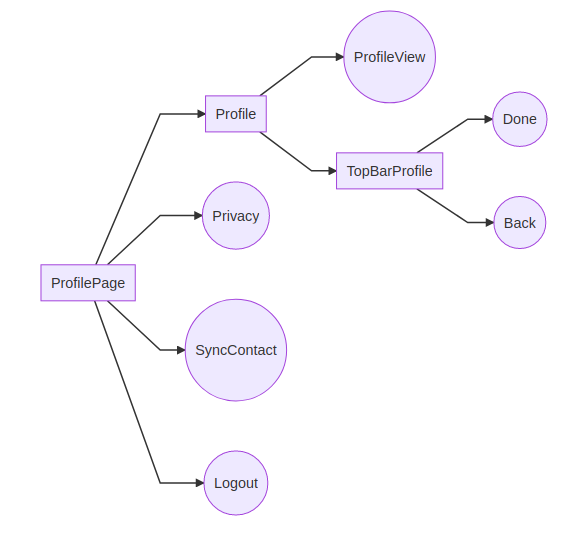

# set-up (set-app)

**Mobile application to organise events and sharing micro tasks to friends. **

### Actors
> **User** : person that use the UX 
> **Server** : sorftware (described below)

### 1. Server Architecture
The architecture of this software is ispired to the uncle Bob's *Clean Architecture* [1,2]: four well defined layers, each one has a proper task.

#### 1.1 Infrastructure
#### 1.1.1 Database 
This will be an instance of a database. 
**MongoDB** will be used.

#### 1.1.2 WebAPI 
This will be an instance of a WebApi Lib. **ExpressJS** will be used.

#### 1.1.3 Mobile Application 
The mobile application is the main user interface. The **Ionic4** framework will be used. Data will be stored in the **sql-lite** mobile database. The UX will accomplish the **Material Design** line guide.

#### 1.2 Controller/UseCases

#### 1.2.1 General diagram for UseCase 
Trasform the data for the **UseCases** and vice versa.

### 1.3 Server Uses Cases

* [X] **CRUD Event**

> CRUD on Event entity. This use case will be implemented both in server-side and client-side.

* [X] **CRUD Profile**

> CRUD on Profile entity. This use case will be implemented both in server-side and client-side.

* [X] **CRUD Task to Event**

> CRUD on Task entity. This use case will be implemented both in server-side and client-side.

* [ ] **Syncronize Data**

> This will be used when User starts the UX. It is useful to check if new events and/or tasks is missing in local DB .

* [ ] **Sent Notify**

> CRUD on Event entity. This use case will be implemented both in server-side and client-side.

### 1.4 Client Uses Cases
* [ ] **Get contacts**

> Get contacts from phone and syncronize these with the server.

### 1.5 Entities
* [X] **Profile**

> Describes the system's user [Profile.js](https://gitlab.com/alfarruggia/set-up/tree/master/Entities/Profile.js)

* [X] **Event**

> Describes the event create by the user [Event.js](https://gitlab.com/alfarruggia/set-up/tree/master/Entities/Event.js)

* [X] **Task**
> Describes a task associated to the event [Task.js](https://gitlab.com/alfarruggia/set-up/tree/master/Entities/Task.js)

### 1.5 Test

* [X] **Event Use Case**
* [X] **Profile Use Case**
* [X] **Task Use Case**

### 1.6 UX Template Inspiring
* [ ]  [ionfacebook](https://market.ionicframework.com/themes/ionfacebook)

* [ ]  [ionmessenger](https://market.ionicframework.com/themes/ionmessenger)

* [ ]  [ion2fullapp-full-ionic2-app-template](https://ionicthemes.com/product/ion2fullapp-full-ionic2-app-template)

### 1.7 UX Workflow MVP

#### 1.7.1  Events

#### 1.7.2 Tasks

#### 1.7.3 Profile

*"Lift as you Climb"* 
[1] http://blog.cleancoder.com/uncle-bob/2012/08/13/the-clean-architecture.html 
[2] http://www.plainionist.net/Implementing-Clean-Architecture-Controller-Presenter/